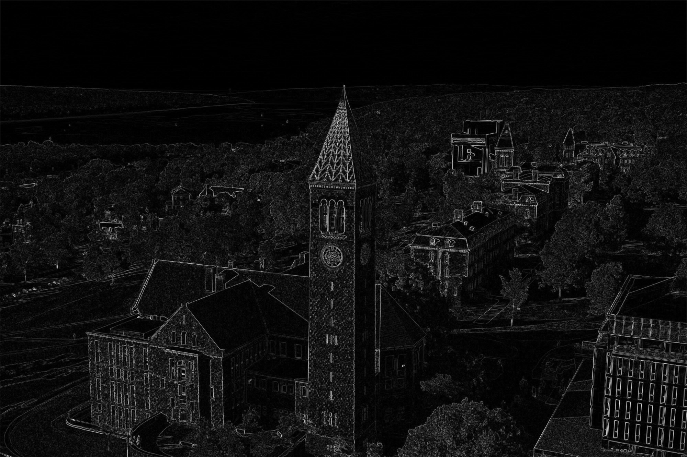
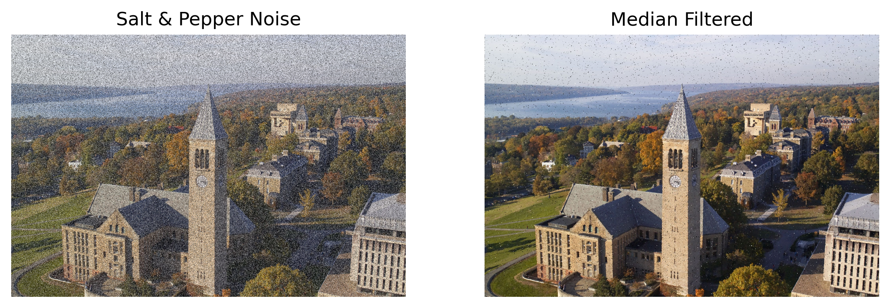

# Image Processing Project  

This project explores various **image processing techniques**, including:  
- **Image Compression** using **K-Means Clustering**  
- **Noise Reduction** using **Median Filtering**  
- **Edge Detection** using **Sobel Filtering**  

## Techniques Used  

### 1️⃣ Image Compression with K-Means Clustering  
I compresses an image to k unique colors using the **K-means clustering** algorithm to reduce image file size. It identifies the k most representative colors and replaces the RGB value of all pixels to match one of those colors.

  

### 2️⃣ Edge Detection  
I detect the edges of an image using **Sobel filtering**, which applies two 3x3 convolution kernels to detect intensity changes in the horizontal and vertical directions. 

  

### 3️⃣ Median Filtering to Reduce Salt and Pepper Noise  
I corrupt an image with salt and pepper noise by randomly replacing pixels with pure white or black pixels. Then, I apply **Median filtering** by replacing each pixel with the median value of its 3 x 3 neighborhood to reduce the noise.   

  

## Languages and Libraries  

- **Python**  
- **OpenCV**  
- **Scikit-learn**  
- **Matplotlib**  
- **NumPy**   
