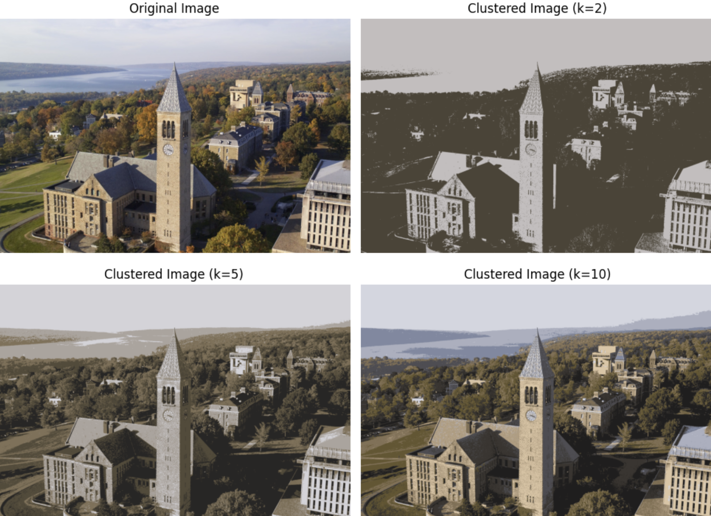

# Image Compression with K-Means Clustering

This project compresses an image to *k* unique colors using the K-means clustering algorithm to reduce image file size.
It identifies the *k* most representative colors and replaces the RGB value of all pixels to match one of those colors.

## Languages and Libraries

- **Python**
- **OpenCV**
- **Scikit-learn**
- **Matplotlib**
- **NumPy**
